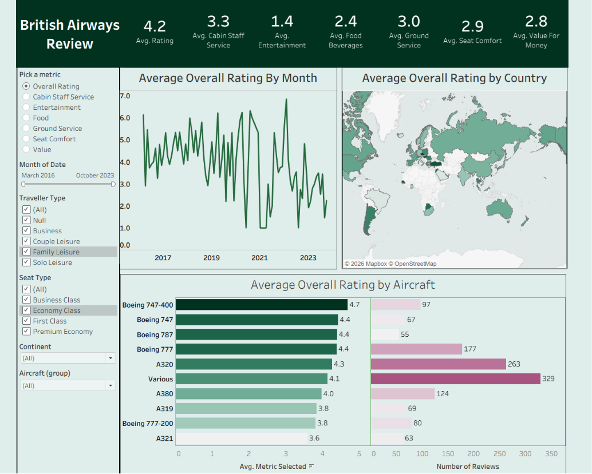

# Tableau Portfolio Project: Transforming Raw Data into Strategic Business Value

## Project Overview
This repository contains an end-to-end business intelligence and data visualization solution built in Tableau. The objective of this project is to bridge the gap between raw, unstructured data and high-level corporate strategy by engineering an interactive, executive-facing dashboard that identifies performance bottlenecks and uncovers operational efficiencies.

## Business Value and Impact
This solution bypasses generic reporting to deliver targeted, data-driven utility for corporate leadership:
*   **Operational Efficiency:** Pinpoints systematic bottlenecks in workflow performance, enabling resource optimization and targeted process interventions.
*   **Accelerated Decision-Making:** Replaces distributed, static spreadsheets with a centralized, high-level KPI tracking framework, drastically minimizing manual data deep dives.
*   **Strategic Optimization:** Integrates dynamic trend analysis and behavioral metrics to help organizational stakeholders rapidly identify underperforming segments and proactively pivot strategies.

## Repository Structure
The project assets are organized into the following directory framework:
*   **data/**: Contains the raw source datasets (e.g., `ba_reviews.csv`) prepped for ingestion.
*   **file/**: Houses the finalized, packaged Tableau workbook file (`tableau_dashboard_file.twbx`).
*   **image/**: Stores dashboard interface screenshots (`dashboard.png`) utilized for technical documentation.

## Project Architecture and Technical Workflow
1.  **Data Preparation and Ingestion:** Extracted, cleaned, and structured the underlying raw datasets within the `data/` directory. Handled missing records, established optimal data schemas, and enforced data integrity prior to visualization.
2.  **Dashboard Architecture:** Developed a multi-layered dashboard layout inside Tableau focusing on analytical scalability, stakeholder usability, granular filtering, and intuitive navigational logic.
3.  **Visual Storytelling:** Applied professional design principles—incorporating strict corporate color theory, clean typographic hierarchy, and decluttered layouts—to ensure immediate clarity for non-technical leadership.

## Functional Features
*   **Executive Summary KPI Cards:** At-a-glance performance metrics comparing current operational states against targeted benchmarks.
*   **Interactive Parameters and Filters:** Granular segmentation capabilities allowing users to slice data dynamically by region, time cohort, and category.
*   **Trend and Performance Indicators:** Embedded analytical indicators designed to highlight historical patterns and surface directional projections.

## Live Dashboard
**[View the Interactive Dashboard on Tableau Public](https://public.tableau.com/app/profile/suraj.suraj1627/viz/dashboard_tableau_17835603670590/Dashboard1?publish=yes)**

---
*For inquiries, technical optimizations, or collaborative discussions, please open an issue within this repository or connect via LinkedIn.*
